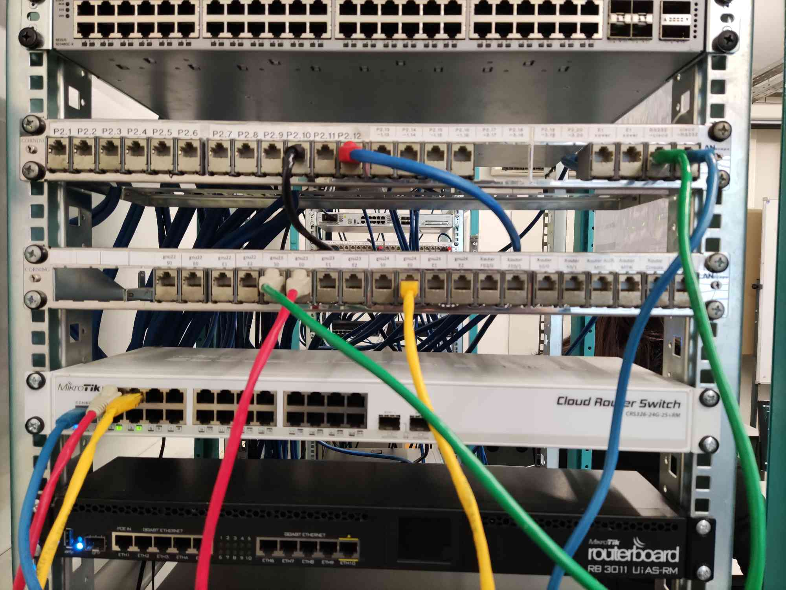
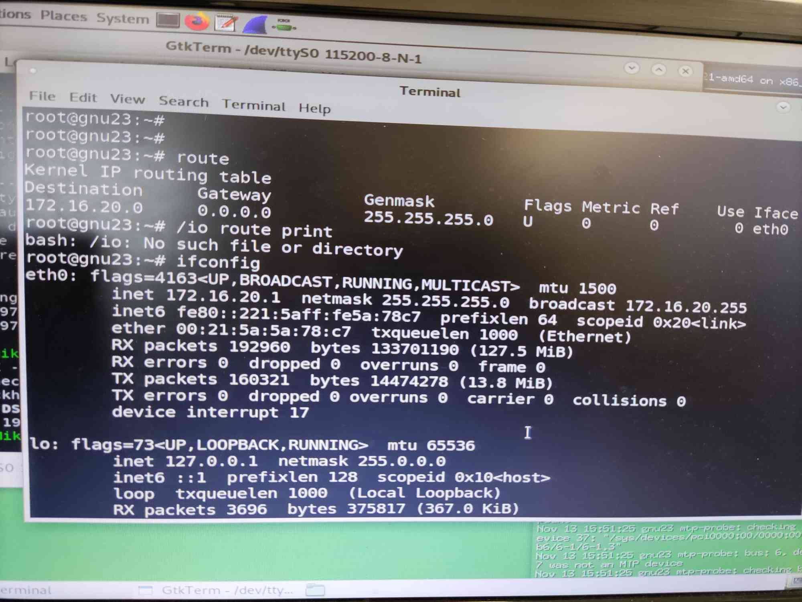
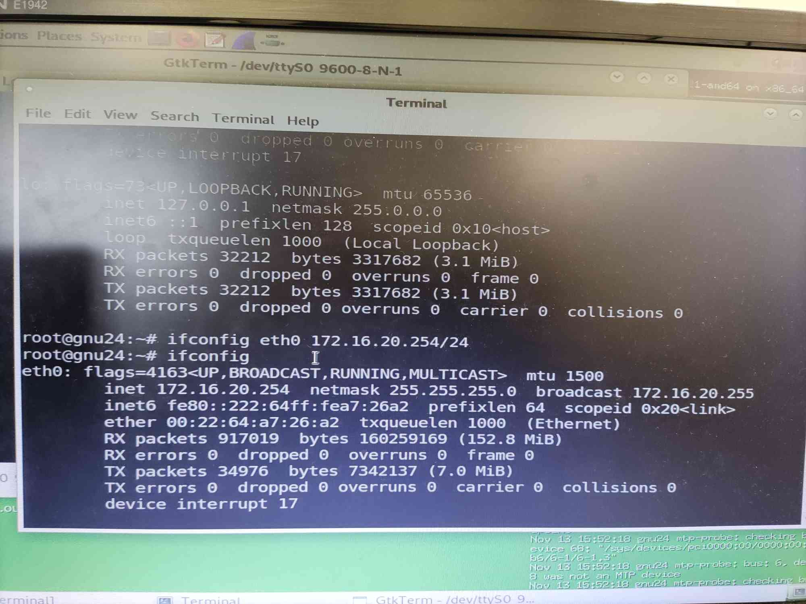

# Configuration and Study of a Network

## Experience 1 - Configure an IP Network

### Steps
#### 1. Disconnect the switch from netlab (PY.1). Connect tuxY3 and tuxY4 to the switch



#### 2. Configure tuxY3 and tuxY4 using ifconfig and route commands

- Reset the Mikrotik switch
    - Open GTKterm
    - Set Baudrate to 115200
    - Username - admin
    - Password - (blank)
    - /system reset-configuration
        - y
        - [ENTER]

- Configure tuxY3
``` bash
ifconfig eth0 up
ifconfig eth0 172.16.20.1/24
```

- Configure tuxY4
``` bash
ifconfig eth0 up
ifconfig eth0 172.16.20.254/24
```

#### 3. Register the IP and MAC addresses of network interfaces

- tuxY3:


- tuxY4:


#### 4. Use ping command to verify connectivity between these computers

- tuxY3:
``` bash
ping 172.16.20.254
```

#### 5. Inspect forwarding (route -n) and ARP (arp -a) tables
#### 6. Delete ARP table entries in tuxY3 (arp -d ipaddress)

- tuxY3:
``` bash
ping 172.16.20.254
```

#### 7. Start Wireshark in tuxY3.eth0 and start capturing packets

- Start **Wireshark**

- Double click eth0

#### 8. In tuxY3, ping tuxY4 for a few seconds

``` bash
ping 172.16.20.254
```

#### 9. Stop capturing packets

#### 10. Save the log and study it at home

- Available [here](log1.pcapng).

### Questions

#### What are the commands required to configure this experience?


#### What are the ARP packets and what are they used for?
#### What are the MAC and IP addresses of ARP packets and why?
#### What packets does the ping command generate?
#### What are the MAC and IP addresses of the ping packets?
#### How to determine if a receiving Ethernet frame is ARP, IP, ICMP?
#### How to determine the length of a receiving frame?
#### What is the loopback interface and why is it important?