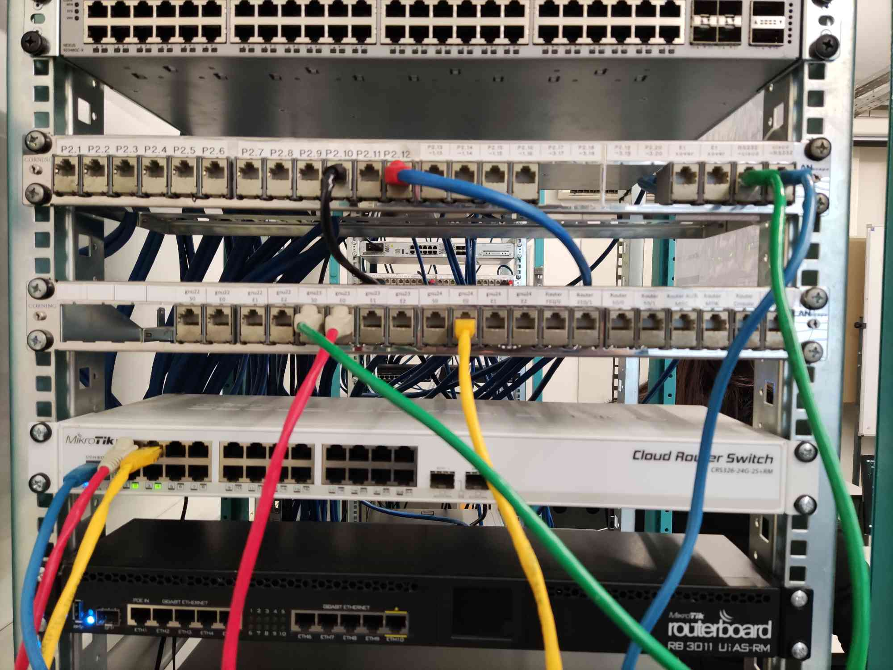
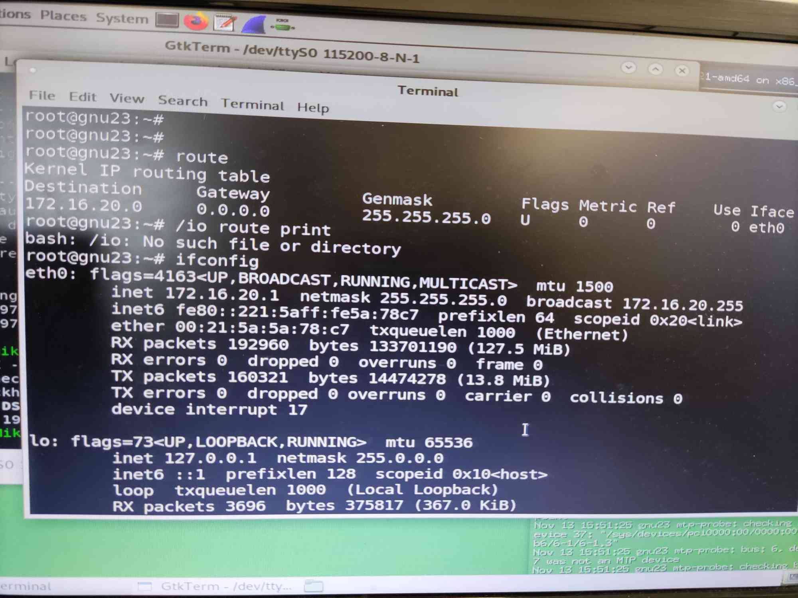
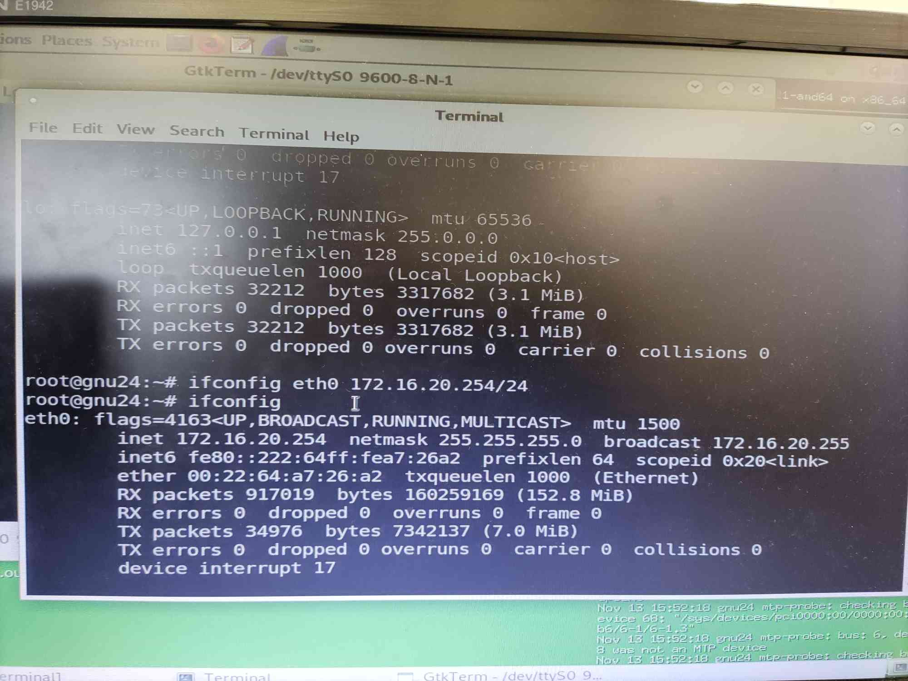
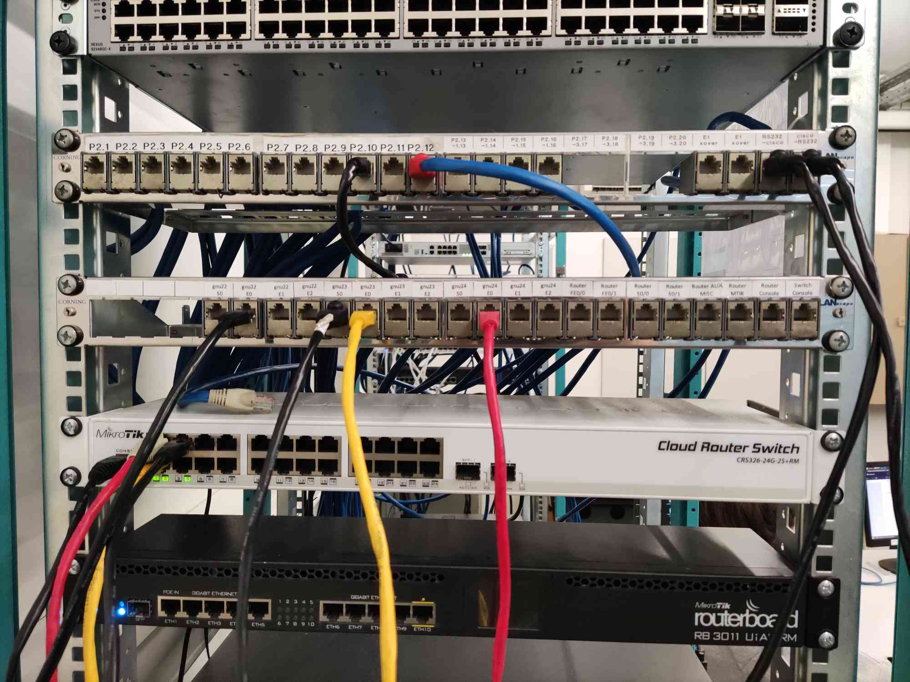
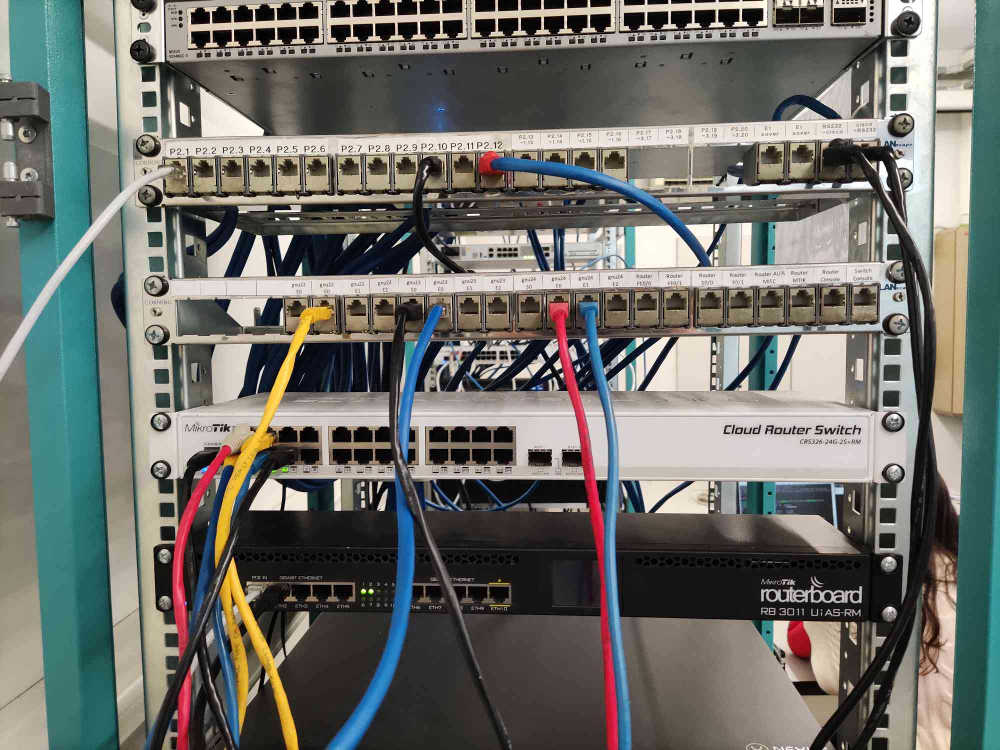
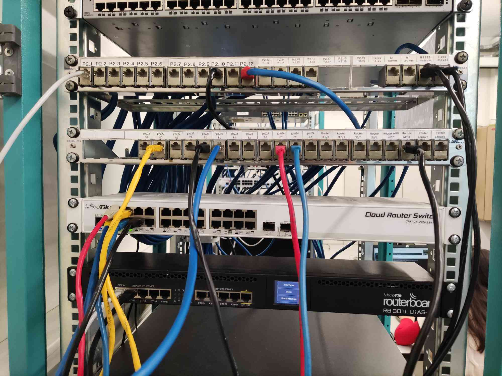

# Configuration and Study of a Network

## Experience 1 - Configure an IP Network

### Steps

#### 1. Disconnect the switch from netlab (PY.1). Connect tuxY3 and tuxY4 to the switch



#### 2. Configure tuxY3 and tuxY4 using ifconfig and route commands

- Reset the Mikrotik switch
    - Open GTKterm
    - Set Baudrate to 115200
    - Username - admin
    - Password - (blank)
    - /system reset-configuration
        - y
        - [ENTER]

- Configure tuxY3
``` bash
ifconfig eth0 up
ifconfig eth0 172.16.20.1/24
```

- Configure tuxY4
``` bash
ifconfig eth0 up
ifconfig eth0 172.16.20.254/24
```

#### 3. Register the IP and MAC addresses of network interfaces

- tuxY3:


- tuxY4:


#### 4. Use ping command to verify connectivity between these computers

- tuxY3:
``` bash
ping 172.16.20.254
```

#### 5. Inspect forwarding (route -n) and ARP (arp -a) tables
#### 6. Delete ARP table entries in tuxY3 (arp -d ipaddress)

- tuxY3:
```
arp -a
arp -d [INSERT IP HERE]
```

#### 7. Start Wireshark in tuxY3.eth0 and start capturing packets

- tuxY3:
    - Start **Wireshark**
    - Double click eth0

#### 8. In tuxY3, ping tuxY4 for a few seconds

``` bash
ping 172.16.20.254
```

#### 9. Stop capturing packets

#### 10. Save the log and study it at home

- [log1.pcapng](logs/log1.pcapng)

### Questions

#### What are the commands required to configure this experience?

First we need to reset the network configuration in Mikrotik:
```
/system reset-configuration
y
```

Then, we need to configure tuxY3:
``` bash
ifconfig eth0 up
ifconfig eth0 172.16.20.1/24
```

..and tuxY4:
``` bash
ifconfig eth0 up
ifconfig eth0 172.16.20.254/24
```

#### What are the ARP packets and what are they used for?

ARP packets are part of the Address Resolution Protocol, which is a communication mechanism that is used to translate network adresses to physical permanent addresses on a local network.

#### What are the MAC and IP addresses of ARP packets and why?

The MAC addresses are the physical addresses of the machine and the IP addresses are the network addresses associated with that machine at the moment.

#### What packets does the ping command generate?

Both ARP and ICMP packets. First it generates an ARP packet do discover the target's mac address and, afterwards, it generates ICMP packets to test if it can reach it.

#### What are the MAC and IP addresses of the ping packets?

The MAC address and IP addresses of ping packets are those of the sender and the receiver of the packets.

#### How to determine if a receiving Ethernet frame is ARP, IP, ICMP?

The type of a frame can be found in it's header:
- ARP: type 0x0806.
- IP: type 0x0800.
    - ICMP (subtype of IP frames): protocol number 1.

In wireshark, it can be found under the 'Protocol' column.

#### How to determine the length of a receiving frame?

The length of a frame can be found in it's header.

In wireshark, it can be found under the 'length' column.

#### What is the loopback interface and why is it important?

A loopback interface is a virtual interface that is always up and reachable as long as at least one of the IP interfaces on the switch is operational. As a result, a loopback interface is useful for debugging tasks since its IP address can always be pinged if any other switch interface is up.

## Experience 2 - Implement two bridges in a switch

### Steps

#### 1. Connect and configure tuxY2 and register its IP and MAC addresses



- Configure tuxY2
``` bash
ifconfig eth0 up
ifconfig eth0 172.16.21.1/24
```

#### 2. Create two bridges in the switch: bridgeY0 and bridgeY1

- Mikrotik:
```
/interface bridge add name=bridgeY0
/interface bridge add name=bridgeY1
/interface bridge print
```


#### 3. Remove the ports where tuxY3, tuxY4 and tuxY2 are connected from the default bridge (bridge) and add them the corresponding ports to bridgeY0 and bridgeY1

- Mikrotik:
```
/interface bridge port print brief
/interface bridge port remove [find interface=ether1]
/interface bridge port remove [find interface=ether2]
/interface bridge port remove [find interface=ether4]
/interface bridge port add bridge=bridgeY0 interface=ether1
/interface bridge port add bridge=bridgeY0 interface=ether2
/interface bridge port add bridge=bridgeY1 interface=ether4
```


#### 4. Start the capture at tuxY3.eth0

- tuxY3:
    - Start **Wireshark**
    - Double click eth0

#### 5. In tuxY3, ping tuxY4 and then ping tuxY2

- tuxY3:
``` bash
ping 172.16.20.254
ping 172.16.21.1
```

#### 6. Stop the capture and save the log

- [log2part1.pcapng](logs/log2part1.pcapng)

#### 7. Start new captures in tuxY2.eth0, tuxY3.eth0, tuxY4.eth0

#### 8. In tuxY3, do ping broadcast for a few seconds

- tuxY2/tuxY3/tuxY4:
    - Start **Wireshark**
    - Double click eth0

- tuxY3:
``` bash
ping -b 172.16.20.255
```

#### 9. Observe the results, stop the captures and save the logs

- [log2part2tux2.pcapng](logs/log2part2tux2.pcapng)
- [log2part2tux3.pcapng](logs/log2part2tux3.pcapng)
- [log2part2tux4.pcapng](logs/log2part2tux4.pcapng)

#### 10. Repeat steps 7, 8 and 9, but now ping broadcast in tuxY2 (ping -b 172.16.Y1.255)

- tuxY2/tuxY3/tuxY4:
    - Start **Wireshark**
    - Double click eth0

- tuxY2:
``` bash
ping -b 172.16.21.255
```

- Logs:
    - [log2part3tux2.pcapng](logs/log2part3tux2.pcapng)
    - [log2part3tux3.pcapng](logs/log2part3tux3.pcapng)
    - [log2part2tux4.pcapng](logs/log2part3tux4.pcapng)

### Questions

#### How to configure bridgeY0?

In Mikrotik, do the following:
```
/interface bridge add name=bridgeY0
/interface bridge port remove [find interface=ether1]
/interface bridge port remove [find interface=ether2]
/interface bridge port add bridge=bridgeY0 interface=ether1
/interface bridge port add bridge=bridgeY0 interface=ether2
```

#### How many broadcast domains are there? How can you conclude it from the logs?

There are 2 broadcast domains. This can be concluded from the logs by verifying that, when tux3 is pinging broadcast packets, only tux4 receives them, indicating that tux2 is part of a separate broadcast. This is confirmed by the fact that, when tux2 is the one pinging broadcast packets, they are not received by any of the other 2 tux.

## Experience 3 - Configure a Router in Linux

### Steps

#### 1. Transform tuxY4 (Linux) into a router

##### Configure also tuxY4.eth1 and add it to bridgeY1


- Configure tuxY4.eth1:
``` bash
ifconfig eth1 down
ifconfig eth1 172.16.21.253/24
```

- Mikrotik
```
/interface bridge port remove [find interface=ether3]
/interface bridge port add bridge=bridgeY1 interface=ether3
```

##### Enable IP forwarding

tuxY4:
``` bash
sysctl net.ipv4.ip_forward=1
```

##### Disable ICMP echo-ignore-broadcast

tuxY4:
``` bash
sysctl net.ipv4.icmp_echo_ignore_broadcasts=0
```

#### 2. Observe MAC addresses and IP addresses in tuxY4.eth0 and tuxY4.eth1


#### 3. Reconfigure tuxY3 and tuxY2 so that each of them can reach the other

tuxY3:
```
route add -net 172.16.21.0/24 gw 172.16.20.254
```

tuxY2:
```
route add -net 172.16.20.0/24 gw 172.16.21.253
```

#### 4. Observe the routes available at the 3 tuxes (route -n)

tuxY2:


tuxY3:


tuxY4:


#### 5. Start capture at tuxY3

- tuxY3:
    - Start **Wireshark**
    - Double click eth0

#### 6. From tuxY3, ping the other network interfaces (172.16.Y0.254, 172.16.Y1.253, 172.16.Y1.1) and verify if there is connectivity

- tuxY3:
``` bash
ping 172.16.20.254
ping 172.16.21.253
ping 172.16.21.1
```

#### 7. Stop the capture and save the logs

- [log3part1.pcapng](logs/log3part1.pcapng)

#### 8. Start capture in tuxY4; use 2 instances of Wireshark, one per network interface

- tuxY4:
    - Start **Wireshark**
    - Double click eth0
    - Start another instance of **Wireshark**
    - Double click eth1

#### 9. Clean the ARP tables in the 3 tuxes

```
arp -a
arp -d [INSERT IP HERE]
```

#### 10. In tuxY3, ping tuxY2 for a few seconds.

- tuxY3:
``` bash
ping 172.16.21.1
```

#### 11. Stop captures in tuxY4 and save logs

- [log3part2eth0.pcapng](logs/log3part2eth0.pcapng)

- [log3part2eth1.pcapng](logs/log3part2eth1.pcapng)

### Questions

#### What are the commands required to configure this experience?

First, we need to configure tuxY4.eth1:

``` bash
ifconfig eth1 down
ifconfig eth1 172.16.21.253/24
```

..and add it to bridgeY1 on Mikrotik:
``` bash
/interface bridge port remove [find interface=ether3]
/interface bridge port add bridge=bridgeY1 interface=ether3
```

Enable IP forwarding and disable ICMP echo-ignore-broadcast on tuxY4:
``` bash
sysctl net.ipv4.ip_forward=1
sysctl net.ipv4.icmp_echo_ignore_broadcasts=0
```

#### What routes are there in the tuxes? What are their meaning?

tuxY2:


tuxY3:


tuxY4:


There are 2 other routes apart from the default ones: A route in tux2 and other in tux3. These routes are used for communication between them using tux4 as their gateway, since it is acting as a router.

#### What information does an entry of the forwarding table contain?

- Destination IP
- Gateway to reach that destination

#### What ARP messages, and associated MAC addresses, are observed and why?

The arp messages observed show that tux3 always asks for tux4's MAC address instead of the destination. This makes sense, since tux4 is acting like a router which makes the connection between tux3 and tux2. Tux4 is the one that asks for tux2's MAC address.

#### What ICMP packets are observed and why?

The ICMP packets are sent between tux3 and tux2, since these are the machines that are communicating with each other, even though they are using a router.

#### What are the IP and MAC addresses associated to ICMP packets and why? 

The ICMP packets observed show tux3's and tux2's IP addresses addresses but the MAC address is the one of tux4, since that is the one that makes the connection

## Experience 4 - Configure a Commercial Router and Implement NAT

### Steps

#### 1. Connect ether1 of Rc to the lab network on PY.1 (with NAT enabled by default) and ether2 of Rc to a port on bridgeY1. Configure the IP addresses of Rc through the router serial console



- Mikrotik Switch:
```
/interface bridge port remove [find interface=ether5]
/interface bridge port add bridge=bridgeY1 interface=ether5
```



- Mikrotik Router:
```
/system reset-configuration
y

/ip address add address=172.16.2.29/24 interface=ether1 
/ip address add address=172.16.21.254/24 interface=ether2
```

#### 2. Verify routes

##### tuxY4 as default router of tuxY3;

tuxY3:
``` bash
route add default gw 172.16.20.254
```

##### Rc as default router for tuxY2 and tuxY4

tuxY2/tuxY4:
``` bash
route add default gw 172.16.21.254
```

##### in tuxY2 and Rc add routes for 172.16.Y0.0/24

- Mikrotik Router:
```
 /ip route add dst-address=172.16.20.0/24 gateway=172.16.21.253
 /ip route add dst-address=0.0.0.0/0 gateway=172.16.21.254
```

#### 3. Using ping commands and Wireshark, verify if tuxY3 can ping all the network interfaces of tuxY2, tuxY4 and Rc

#### 4. In tuxY2

##### Do the following:
``` bash
sysctl net.ipv4.conf.eth0.accept_redirects=0
sysctl net.ipv4.conf.all.accept_redirects=0
```

#####  remove the route to 172.16.Y0.0/24 via tuxY4
tuxY4:
``` bash
route delete -net 172.16.20.0/24 gw 172.16.21.253
```

##### In tuxY2, ping tuxY3

tuxY2:
``` bash
ping 172.16.20.1
```

##### Using capture at tuxY2, try to understand the path followed by ICMP ECHO and ECHO-REPLY packets (look at MAC addresses)

##### In tuxY2, do traceroute tuxY3

tuxY2:
``` bash
traceroute -n 172.16.20.1
```

##### In tuxY2, add again the route to 172.16.Y0.0/24 via tuxY4 and do traceroute tuxY3

tuxY2:
``` bash
route add -net 172.16.20.0/24 gw 172.16.21.253 
traceroute -n 172.16.20.1
```

##### Activate the acceptance of ICMP redirect at tuxY2 when there is no route to 172.16.Y0.0/24 via tuxY4 and try to understand what happens

tuxY2:
``` bash
sysctl net.ipv4.conf.eth0.accept_redirects=0
sysctl net.ipv4.conf.all.accept_redirects=0
```

#### 5. In tuxY3, ping the router of the lab I.320 (172.16.2.254) and try to understand what happens

tuxY3:
``` bash
ping 172.16.2.254
```

#### 6. Disable NAT functionality in router RC

- Mikrotik Router:
```
/ip firewall nat disable 0
```

#### 7. In tuxY3 ping 172.16.2.254, verify if there is connectivity, and try to understand what happens
tuxY3:
``` bash
ping 172.16.2.254
```

### Questions

#### How to configure a static route in a commercial router?

First, reset the configuration:
- Mikrotik Router:
```
/system reset-configuration
y
```

Then, adding it to the local network and adding the necessary routes.

#### What are the paths followed by the packets in the experiments carried out and why?

At first, the packets were redirected from the router, since there was no connection between the computers. Then, when a more efficient path appeared, they stopped being redirect through the router.

#### How to configure NAT in a commercial router?

To disable it:
```
/ip firewall nat enable 0
```
 
#### What does NAT do?
Network Address Translation (NAT) is a method of mapping an IP address space into another by modifying network address information in the IP header of packets while they are in transit accross a traffic routing device. It is useful for translating local addresses into public addresses and vice-versa.

